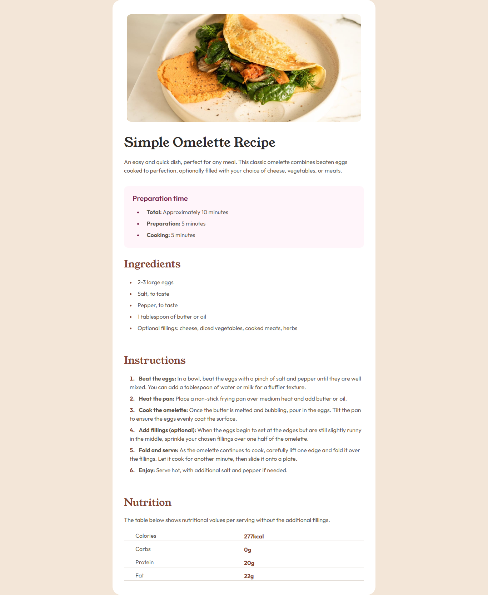

# Frontend Mentor - Recipe page solution

This is a solution to the [Recipe page challenge on Frontend Mentor](https://www.frontendmentor.io/challenges/recipe-page-KiTsR8QQKm). Frontend Mentor challenges help you improve your coding skills by building realistic projects.

## Table of contents

- [Overview](#overview)
  - [The challenge](#the-challenge)
  - [Screenshot](#screenshot)
  - [Links](#links)
- [My process](#my-process)
  - [Built with](#built-with)
  - [What I learned](#what-i-learned)
  - [Continued development](#continued-development)
- [Author](#author)

## Overview

### Screenshot

### Links

- Solution URL: [Solution URL](https://github.com/ahsanma/recipe-page-main)
- Live Site URL: [Live Site URL](https://ahsanma.github.io/recipe-page-main)

## My process

### Built with

- CSS custom properties
- BEM CSS Methodology
- Flexbox
- Mobile-first workflow

### What I learned

- Flexbox's `flex-basis` property
- HTML `::marker` pseudo element
- How to style list elements

### Continued development

- More in depth CSS Flexbox
- CSS Grid
- Responsive Design

## Author

- Website - [ahsanma](https://github.com/ahsanma)
- Frontend Mentor - [@ahsanma](https://www.frontendmentor.io/profile/ahsanma)
